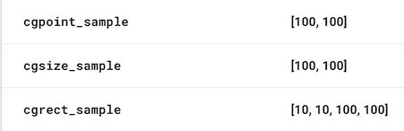

# Lobster
Type-safe Firebase-RemoteConfig helper library


[](https://github.com/sgr-ksmt/Lobster/releases)

[](https://github.com/Carthage/Carthage)
[](https://cocoapods.org/pods/Lobster)
[](https://cocoapods.org/pods/Lobster)

## Feature
- Make config value **Type safe.** ✨
- Easy to set default value by subscripting.
- Custom type available ✨
  - Can use `Decodable` struct. (load from raw-data or json string)

**There's only three steps to using Lobster:**

- Define `ConfigKey`

```swift
extension ConfigKey {
    static let titleText = ConfigKey<String>("title_text")
    static let titleColor = ConfigKey<UIColor>("title_color")
}
```

- Define value in Firebase project


- Just use it!

```swift
Lobster.shared.debugMode = true
Lobster.shared.fetchExpirationDuration = 0.0
Lobster.shared[.titleText] = "Default Title"
Lobster.shared[.titleColor] = .gray

Lobster.shared.fetch { [weak self] _ in
    self?.titleLabel.text = Lobster.shared[.titleText]
    self?.titleLabel.textColor = Lobster.shared[.titleColor]
}
```

You can get Type-Safed value through subscripting syntax`([])` by defining `ConfigKey`.

## How to use
### Fetch latest value from remote.
```swift
Lobster.shared.fetch { [weak self] error in
    if let error = error {
        print(error)
    }
    self?.titleLabel.text = Lobster.shared[.titleText]
}
```

### Get value
Use subscripting syntax.

```swift
// Get value.
// If value didn't fetch from remote yet. returns default value (if exists).
let title = Lobster.shared[.titleText]
```

#### Always get default value
Use `[default:]` subscripting syntax.

```swift
// Get default value if set.
let title = Lobster.shared[default: .titleText]
```

### Set Default value
You can set default values using `subscripting syntax` or plist.

```swift
Lobster.shared[.titleText] = "Cart Items"
Lobster.shared[.titleColor] = .black

// or load from `defaults.plist`
Lobster.shared.setDefaults(fromPlist: "defaults")
```

### Set debug mode
```swift
// Enable debug mode (development only)
Lobster.shared.debugMode = true
Lobster.shared.fetchExpirationDuration = 0.0
```

### more...
Pleaes check Demo project :heart:

### Demo
Required: CocoaPods 1.4 beta or higher.

```bash
$ cd path/to/Lobster
$ bundle install
$ cd ./Demo
$ bundle exec pod install
$ open Demo.xcworkspace
```

## Supported types

Lobster supports types below.

- String
- NSNumber
- Int
- Float
- Double
- Bool

#### URL
support text: e.g. `"https://www.google.co.jp"`


#### UIColor
support only hex: e.g. `"#FF00FF"`


#### CGPoint
support text: e.g. `"[100, 100]"`  
→ Use `DecodableConfigKey`(or `CodableConfigKey`)

```swift
extension ConfigKeys {
    static let labelOrigin = CodableConfigKey<CGPoint>("label_origin")
}
```

#### CGSize
support text: e.g. `"[100, 100]"`  
→ Use `DecodableConfigKey`(or `CodableConfigKey`)

```swift
extension ConfigKeys {
    static let boxSize = CodableConfigKey<CGSize>("box_size")
}
```

#### CGRect
support text: e.g. `"[10, 10, 100, 100]"`  
→ Use `DecodableConfigKey`(or `CodableConfigKey`)

```swift
extension ConfigKeys {
    static let boxRect = CodableConfigKey<CGRect>("box_rect")
}
```

<br />



#### Enum
supports `Int` or `String` rawValue.  
If you want to use other enum, see "Use custom value".

#### Decodable compliant type 
read only

#### Codable compliant type 
can set default value / read config value


## Use custom value
You can easily define custom key in order to get remote value.

### Example1: enum

```swift
enum Status {
    case invalid
    case foo(String)
    case bar(String)

    init(value: String?) {
        guard let value = value else {
            self = .invalid
            return
        }
        let separated = value.components(separatedBy: ":")
        guard let query: (String, String) = separated.first.flatMap({ f in separated.last.flatMap({ l in (f, l) })}) else {
            self = .invalid
            return
        }
        switch query {
        case ("foo", let x):
            self = .foo(x)
        case ("bar", let x):
            self = .bar(x)
        default:
            self = .invalid
        }
    }

    var value: String {
        switch self {
        case .foo(let x):
            return "foo:\(x)"
        case .bar(let x):
            return "bar:\(x)"
        default:
            return ""
        }
    }
}

// define subscript
extension Lobster {
    subscript(_ key: ConfigKey<Status>) -> Status? {
        get { return Status(value: configValue(forKey: key._key)) }
        set { setDefaultValue(newValue?.value, forKey: key._key) }
    }
}

// define ConfigKey
extension ConfigKeys {
    static let status = ConfigKey<Status>("status")
}

// Use
// set default value
Lobster.shared[.status] = .foo("bar")

// get config value
if let status = Lobster.shared[.status] {
    // ...
}
```

To define subscript makes it possible to access custom enum.

### Example2: Decodable compliant type
Just adapt class or struct to Decodable or Codable

```swift
struct Person: Codable {
    let name: String
    let age: Int
    let country: String
}

extension ConfigKeys {
    static let person = CodableConfigKey<Person>("person")
}
```

Define config value like below:


## Requirements
- iOS 9.0+
- Xcode 9+
- Swift 4+

## Installation
### CocoaPods
Only **CocoaPods 1.4 Beta or higher**

**Lobster** is available through [CocoaPods](http://cocoapods.org). To install
it, simply add the following line to your Podfile:

```ruby
pod 'Lobster', '~> 0.1.0'
```

and run `pod install`

### Manually Install
Download all `*.swift` files and put your project.

## Special Thanks
Lobster is inspired by [SwiftyUserDefaults](https://github.com/radex/SwiftyUserDefaults)

## Communication
- If you found a bug, open an issue.
- If you have a feature request, open an issue.
- If you want to contribute, submit a pull request.:muscle:

## License
**Lobster** is under MIT license. See the [LICENSE](LICENSE) file for more info.
