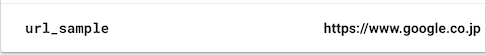
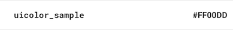

# Lobster
Type-safe Firebase-RemoteConfig helper library


[](https://github.com/sgr-ksmt/Lobster/releases)

[](https://github.com/Carthage/Carthage)
[](https://cocoapods.org/pods/Lobster)
[](https://cocoapods.org/pods/Lobster)

## Feature
- Make config value **type safe.** ✨
- Easy to set default value by key-value subscripting.
- Custom type available ✨
  - `String`/`Int` enum
  - `Decodable`(read-only) and `Codable`.

**There's only three steps to using Lobster:**

- Define `ConfigKey`

```swift
extension ConfigKeys {
    static let welcomeTitle = ConfigKey<String>("welcome_title")
    static let welcomeTitleColor = ConfigKey<UIColor>("welcome_title_color")
}
```

- Define value in Firebase project


- Just use it!

```swift
// Set default value
Lobster.shared[default: .welcomeTitle] = "Welcome"
Lobster.shared[default: .welcomeTitleColor] = .black
self.titleLabel.text = Lobster.shared[.welcomeTitle]

// Fetch remote-config
Lobster.shared.fetch { [weak self] _ in
    self?.titleLabel.text = Lobster.shared[.welcomeTitle]
    self?.titleLabel.textColor = Lobster.shared[.welcomeTitleColor]
}
```

You can get Type-Safed value through subscripting syntax`([])` by defining `ConfigKey`.

## How to use
### Fetch latest value from remote.
```swift
Lobster.shared.fetch { [weak self] error in
    if let error = error {
        print(error)
    }
    self?.titleLabel.text = Lobster.shared[.titleText]
}
```

### Get value
Use subscripting syntax.

- Non-Optional

```swift
extension ConfigKeys {
    static let text = ConfigKey<String>("text")
}

// Get value from config.
// If value didn't fetch from remote yet. returns default value (if exists).
let text: String = Lobster.shared[.text]

// Get value from only config.
// it is possible to crash if value didn't fetch from remote yet.
let text: String = Lobster.shared[config: .text]

// Get value from only default.
// It is possible to crash if the default value is not set yet.
let text: String = Lobster.shared[default: .text]

// [safe:], [safeConfig:], [safeDefault:] subscripting syntax.
// It is safe because they return nil if they have no value.(return type is `Optional<T>`.)
let text: String? = Lobster.shared[safe: .text]
let text: String? = Lobster.shared[safeConfig: .text]
let text: String? = Lobster.shared[safeDefault: .text]
```

- Optional

```swift
extension ConfigKeys {
    static let textOptional = ConfigKey<String?>("text_optional")
}

let text: String? = Lobster.shared[.textOptional]
let text: String? = Lobster.shared[config: .textOptional]
let text: String? = Lobster.shared[default: .textOptional]
```

### Set Default value
You can set default values using `subscripting syntax` or plist.

```swift
// Set default value using `[default:]` syntax.
Lobster.shared[default: .titleText] = "Cart Items"
Lobster.shared[default: .titleColor] = .black

// or load from `defaults.plist`
Lobster.shared.setDefaults(fromPlist: "defaults")
```

### Set debug mode
```swift
// Enable debug mode (development only)
Lobster.shared.debugMode = true
Lobster.shared.fetchExpirationDuration = 0.0
```

### isStaled
If you set `isStaled` to true, Lobster will fetch remote value ignoring `fetchExpirationDuration`.
`isStaled` will be set to `false` after fetched remote value.

```swift
Lobster.shared.fetchExpirationDuration = 60 * 12

Lobster.shared.isStaled = true

// Default expire duration is 12 hours.
// But if `isStaled` set to true,
// Lobster fetch values from remote ignoring expire duration.
Lobster.shared.fetch()
```

## Supported types

Lobster supports more types as default followings:

- String
- Int
- Float
- Double
- Bool
- Data
- URL
- enum(String/Int)
- Decodable Object
- Codable Object
- Collection(Array)
  - String
  - Int
  - Float
  - Double
  - Bool
  - Data
  - URL
  - enum(String/Int)
  - Decodable Object
  - Codable Object

### TODO
- [ ] CGPoint
- [ ] CGSize
- [ ] CGRect
- [ ] Dictionary

#### URL
Supports text: e.g. `"https://example.com"`.



#### UIColor
Supports only HEX string like `"#FF00FF"`.



#### Enum
supports `Int` or `String` rawValue.
It can be used only by adapting `ConfigSerializable`.
If you want to use other enum, see ***Use custom value***.

#### Decodable compliant type
read only

#### Codable compliant type
can set default value / read config value


## Use custom value
You can easily define custom key in order to get remote value.

### Ex 1: enum

```swift
// Adapt protocol `ConfigSerializable`
enum Status: ConfigSerializable {
    // Define `_config`, `_configArray`(If needed).
    // Custom ConfigBridge's definition see below.
    static var _config: ConfigBridge<Status> { return ConfigStatusBridge() }
    static var _configArray: ConfigBridge<[Status]> { fatalError("Not implemented") }

    case unknown
    case active
    case inactive

    init(value: String?) {
        guard let value = value else {
            self = .unknown
            return
        }
        switch value {
        case "active": self = .active
        case "inactive": self = .inactive
        default: self = .unknown
        }
    }

    var value: String {
        switch self {
        case .active: return "active"
        case .inactive: return "inactive"
        default: return ""
        }
    }
}

// Define Bridge class
final class ConfigStatusBridge: ConfigBridge<Status> {
    typealias T = Status

    // Save value to default store
    override func save(key: String, value: T?, defaultsStore: DefaultsStore) {
        defaultsStore[key] = value?.value
    }

    // Get value from RemoteConfig
    override func get(key: String, remoteConfig: RemoteConfig) -> T? {
        return remoteConfig[key].stringValue.flatMap(Status.init(value:))
    }

    // Get value from default store
    override func get(key: String, defaultsStore: DefaultsStore) -> T? {
        return (defaultsStore[key] as? String).flatMap(Status.init(value:))
    }
}

// Define ConfigKey
extension ConfigKeys {
    static let status = ConfigKey<Status>
}

// Set default
Lobster.shared[default: .status] = .inactive

// Use value
Lobster.shared.fetch { _ in
    let currentStatus = Lobster.shared[.status]
}
```

To define subscript makes it possible to access custom enum.

### Ex 2: Decodable compliant type
Just adapt `Decodable` or `Codable` to class or struct and adapt `ConfigSerializable`

```swift
struct Person: Codable, ConfigSerializable {
    let name: String
    let age: Int
    let country: String
}

extension ConfigKeys {
    static let person = CodableConfigKey<Person>("person")
}
```

Define config value like below in console:


## Demo
Required: CocoaPods 1.5 or higher.

```bash
$ cd path/to/Lobster
$ bundle install
$ cd ./Demo
$ bundle exec pod install
$ open Demo.xcworkspace
```

## Requirements
- iOS 11.0+
- Xcode 10+
- Swift 5.0

## Installation
### CocoaPods
**Lobster** is available through [CocoaPods](http://cocoapods.org). To install
it, simply add the following line to your Podfile:

```ruby
pod 'Lobster', '~> 2.2'
```

and run `pod install`

### Manually Install
Download all `*.swift` files and put your project.

## Special Thanks
Lobster is inspired by [SwiftyUserDefaults](https://github.com/radex/SwiftyUserDefaults)

## Communication
- If you found a bug, open an issue.
- If you have a feature request, open an issue.
- If you want to contribute, submit a pull request.:muscle:

## License
**Lobster** is under MIT license. See the [LICENSE](LICENSE) file for more info.
